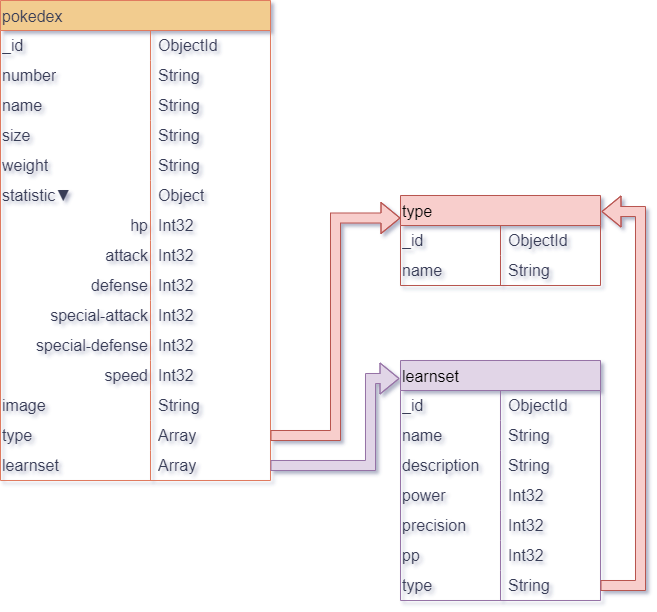

# FastApi-Pokemon

Projet cours IPI Toulouse API avec FastAPI et MongoDB

## Installation

1. Téléchargez et installez Python 3.11 depuis [www.python.org/downloads/](https://www.python.org/downloads/)
2. Téléchargez et installez MongoDB depuis [www.mongodb.com](https://www.mongodb.com) et/ou MongoDB Compass depuis [www.mongodb.com/products/tools/compass](https://www.mongodb.com/products/tools/compass)
   - MongoDB est une plateforme de base de données NoSQL.
   - MongoDB Compass est une interface utilisateur graphique pour MongoDB.
3. Créez un environnement virtuel pour Python :
```python
python -m venv api-venv
```
4. Activez l'environnement virtuel :
```python
.\api-venv\Scripts\activate
```
5. Installez les bibliothèques nécessaires :
```python
pip install -r requirements.txt
```
6. Dans MongoDB Compass, connectez-vous en local avec l'URI : `mongodb://localhost:27017`.
- Créez une nouvelle base de données nommée : `pokedex`.
- Ajoutez 3 collections : `learnset`, `pokemon`, et `type`, que vous compléterez avec les fichiers JSON correspondants trouvables dans le répertoire `bdd`.
7. Exécutez le fichier `main.py` avec la commande :
```python
python .\api\main.py
```

## Documentation

La documentation de l'API, une fois lancée, est disponible ici : [http://localhost:8000/docs](http://localhost:8000/docs)

## Base de données


